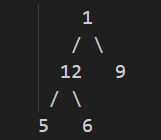
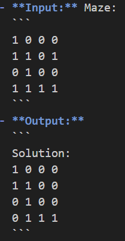

### **Set 2**

#### **1. Delete the First Node**  
**Problem Statement:**  
Write a function to delete the first node of a linked list.  
- **Input:** `10 -> 20 -> 30`  
- **Output:** `20 -> 30`

#### **2. Find the Shortest Path Using BFS**  
**Problem Statement:**  
Write a program to find the shortest path between two nodes in an unweighted, undirected graph.  
- **Input:** Nodes: `5`, Edges: `[(1, 2), (1, 3), (2, 4), (3, 4), (4, 5), (2, 5)]`, Start: `1`, End: `5`  
- **Output:** `Shortest Path: 1 -> 2 -> 5`

#### **3. Find the K Smallest Elements**  
**Problem Statement:**  
Write a program to find the \( k \) smallest elements in an array using Selection Sort.  
- **Input:** `[29, 10, 14, 37, 13]`, \( k = 3 \)  
- **Output:** `3 smallest: [10, 13, 14]`

#### **4. Verify Binary Tree Traversals**  
**Problem Statement:**  
Write a program to create a binary tree and implement Inorder, Preorder, and Postorder traversals.  

- **Input:** Tree:  
  ```
        1
       / \
      12   9
     / \
    5   6
  ```  
- **Output:**  
  ```
  Inorder: 5 12 6 1 9  
  Preorder: 1 12 5 6 9  
  Postorder: 5 6 12 9 1
  ```

#### **5. Rat in a Maze**  
**Problem Statement:**  
Write a program to find a path for a rat to navigate a maze using backtracking.  

- **Input:** Maze:  
  ```
  1 0 0 0  
  1 1 0 1  
  0 1 0 0  
  1 1 1 1  
  ```  
- **Output:**  
  ```
  Solution:  
  1 0 0 0  
  1 1 0 0  
  0 1 0 0  
  0 1 1 1  
  ```

#### **6. Implement a Queue using Arrays**  
**Problem Statement:**  
Write a program to implement a queue using arrays with operations:  
- Enqueue, Dequeue, Front, isEmpty.  
- **Example Input:** Enqueue: `5, 6, 7`  
- **Example Output:** Dequeue: `5`, Front: `6`

---
