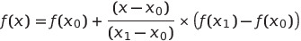

### **Interpolation in Numerical Computation**

Interpolation is a method of estimating unknown values between known data points. It is commonly used in numerical analysis, data science, and engineering to construct new data points within the range of a discrete set of known data points.

---

### **Types of Interpolation**

#### 1. **Linear Interpolation**
- Connects two adjacent points with a straight line and estimates values within this interval.
- Formula:

   - ):  Known points
   - ,f(x_1)\)): Function values at )
  - ): Point to estimate

   

#### 2. **Polynomial Interpolation**
- Fits a polynomial of degree ) through ) data points.
- Example: Lagrange interpolation, Newton's divided differences.

#### 3. **Spline Interpolation**
- Fits piecewise polynomials (often cubic) between data points for smooth curves.
- Widely used for more accurate approximations and smoothness.

---


---

### **Comparison of Methods**
| **Method**               | **Advantages**                                     | **Disadvantages**                               |
|---------------------------|---------------------------------------------------|------------------------------------------------|
| Linear Interpolation      | Simple, efficient for small intervals.            | Not smooth; inaccurate for nonlinear data.     |
| Polynomial Interpolation  | Accurate for small datasets.                      | Prone to oscillation (Runge's phenomenon).     |
| Spline Interpolation      | Smooth, accurate for large datasets.              | More computationally intensive.                |

---

### **Applications of Interpolation**
1. Estimating missing data.
2. Graphics rendering and image resizing.
3. Signal processing.
4. Engineering simulations and modeling.

By choosing the appropriate method, interpolation can provide accurate and efficient solutions for a variety of numerical problems.

### **Linear Interpolation**

Linear interpolation is a simple method of estimating a value within two known values on a straight line. If two points \)) and \)) are known, the value \( y \) at a given \( x \) is estimated as:

\cdot\frac{(y_1-y_0)}{(x_1-x_0)}\])

---

### **Step-by-Step Example**

#### Problem:
Given two points:
- =(1,3)\))
- =(4,7)\))

Estimate the value of \( y \) at \( x = 2.5 \).

#### Solution:
1. Known values:
   - ,\(y_0=3\))
   - ,\(y_1=7\))
   - )

2. Apply the formula:
   \cdot\frac{(y_1-y_0)}{(x_1-x_0)}\])
   Substituting values:
   \cdot\frac{(7-3)}{(4-1)}\])

3. Simplify:
   
   
   

So, the interpolated value is ).


---

### **Applications**
1. **Physics:** Estimating values between measured data points.
2. **Graphics:** Smoothing transitions between keyframes.
3. **Finance:** Predicting intermediate values in stock trends.

Linear interpolation is straightforward, but its accuracy depends on the assumption that the data points lie approximately on a straight line. For nonlinear data, higher-order interpolation methods are recommended.

### **Polynomial Interpolation**

Polynomial interpolation is a numerical method to find a polynomial that passes exactly through a set of given points. If you have \( n+1 \) data points, the interpolating polynomial will have a degree \( n \).

---

### **Key Idea**

Given ) data points:
,(x_1,y_1),\dots,(x_n,y_n),\])
we aim to find a polynomial \)) of degree ) such that:

=y_i\quad\text{for}i=0,1,\dots,n.\])

---

### **Simple Steps**

1. **Identify Data Points:**
   You have ) points ,(x_1,y_1),\dots\)). These points represent known values of the function \( f(x) \).

2. **Construct the Polynomial:**
   - The polynomial \( P(x) \) is a combination of powers of \( x \):
     =a_0&plus;a_1x&plus;a_2x^2&plus;\dots&plus;a_nx^n,\])
     where ) are coefficients to be determined.

3. **Find Coefficients:**
   Use techniques like:
   - **Lagrange interpolation** (construct polynomial directly using basis polynomials).
   - **Newton's divided differences** (iterative approach).

---

### **Simple Example**

#### Problem:
Find a polynomial \( P(x) \) that passes through the points:
\[
(1, 2), (2, 3), (4, 5).
\]

#### Solution:

1. **Number of Points:**
   - We have 3 points (\( n+1 = 3 \)), so the polynomial degree \( n = 2 \):
     \[
     P(x) = a_0 + a_1x + a_2x^2
     \]

2. **Write the System of Equations:**
   For each point, substitute \( x \) and \( y \) into \( P(x) \):
   - For \( (1, 2): \quad 2 = a_0 + a_1(1) + a_2(1)^2 \),
   - For \( (2, 3): \quad 3 = a_0 + a_1(2) + a_2(2)^2 \),
   - For \( (4, 5): \quad 5 = a_0 + a_1(4) + a_2(4)^2 \).

   These give:
   \[
   a_0 + a_1 + a_2 = 2,
   \]
   \[
   a_0 + 2a_1 + 4a_2 = 3,
   \]
   \[
   a_0 + 4a_1 + 16a_2 = 5.
   \]

3. **Solve the System:**
   Solve for \( a_0 \), \( a_1 \), and \( a_2 \). (This can be done manually or using computational tools.)

   Solution:
   \[
   a_0 = 1, \quad a_1 = 0.5, \quad a_2 = 0.25.
   \]

4. **Construct the Polynomial:**
   The polynomial is:
   \[
   P(x) = 1 + 0.5x + 0.25x^2.
   \]

---


### **Key Advantages**
1. **Exact Fit:** The polynomial passes through all the data points.
2. **Smooth Curve:** The resulting polynomial is continuous and differentiable.

### **Key Challenges**
1. **Runge's Phenomenon:** For a high degree \( n \), the polynomial may oscillate wildly.
2. **Computation Complexity:** Solving for coefficients becomes harder as \( n \) increases.

---

For practical purposes, when the number of points is large, **piecewise interpolation** (e.g., spline interpolation) is often preferred.

### **Numerical Solution of Ordinary Differential Equations (ODEs)**

An Ordinary Differential Equation (ODE) is an equation that involves a function and its derivatives. The solution of an ODE typically gives a family of functions. However, in many real-world cases, it is difficult or impossible to obtain an exact analytical solution. Instead, numerical methods are used to approximate the solution over a specific interval.

In this tutorial, we'll focus on solving ODEs using two popular numerical methods: **Euler's Method** and **Runge-Kutta Method**.

---

### **1. Understanding the Problem**

Consider the general first-order ODE:

\[
\frac{dy}{dx} = f(x, y)
\]

Where:
- \( y \) is the unknown function of \( x \).
- \( f(x, y) \) is a known function that defines the relationship between \( x \) and \( y \).
- Initial condition \( y(x_0) = y_0 \) is provided.

We want to find the solution \( y(x) \) over the interval \( [x_0, x_f] \), where \( x_0 \) is the initial value and \( x_f \) is the final value.

---

### **2. Euler's Method**

Euler's method is one of the simplest and most commonly used numerical techniques to approximate solutions to ODEs. The basic idea is to discretize the continuous problem into small steps and approximate the function value at each step.

#### Formula for Euler's Method:
Given the ODE \( \frac{dy}{dx} = f(x, y) \), the approximation is:

\[
y_{n+1} = y_n + h \cdot f(x_n, y_n)
\]

Where:
- \( y_n \) is the approximation of \( y(x_n) \).
- \( h \) is the step size (distance between successive \( x \)-values).
- \( f(x_n, y_n) \) is the value of the function at \( (x_n, y_n) \).

### **Euler's Method**

Euler's Method is a straightforward numerical technique to approximate the solution of an Ordinary Differential Equation (ODE). It works by stepping forward in small increments from an initial condition and using the slope at each point to estimate the next value.

---

### **The Problem**

We aim to solve the first-order ODE:

\[
\frac{dy}{dx} = f(x, y),
\]

with an initial condition:

\[
y(x_0) = y_0.
\]

Euler's method approximates the solution by taking small steps of size \( h \) along the \( x \)-axis and updating \( y \) using the formula:

\[
y_{n+1} = y_n + h \cdot f(x_n, y_n),
\]

where:
- \( (x_n, y_n) \) is the current point,
- \( h \) is the step size,
- \( f(x_n, y_n) \) is the slope (from the ODE).

---

### **Example: Solve \( \frac{dy}{dx} = x + y \)**

#### Problem:
Solve the ODE \( \frac{dy}{dx} = x + y \) with the initial condition \( y(0) = 1 \), from \( x = 0 \) to \( x = 1 \), using a step size \( h = 0.1 \).

---

### **Step-by-Step Solution**

1. **Initial Values**:
   - \( x_0 = 0, y_0 = 1 \),
   - Step size \( h = 0.1 \).

2. **Formula**:
   Use the Euler's method formula:
   \[
   y_{n+1} = y_n + h \cdot f(x_n, y_n),
   \]
   where \( f(x, y) = x + y \).

3. **Iteration**:
   Compute \( y \) at successive \( x \)-values:
   - \( x_1 = x_0 + h = 0.1 \),
   - \( y_1 = y_0 + h \cdot f(x_0, y_0) = 1 + 0.1 \cdot (0 + 1) = 1.1 \),
   - \( y_2 = y_1 + h \cdot f(x_1, y_1) = 1.1 + 0.1 \cdot (0.1 + 1.1) = 1.1 + 0.1 \cdot 1.2 = 1.22 \),
   - \( y_3 = y_2 + h \cdot f(x_2, y_2) = 1.22 + 0.1 \cdot (0.2 + 1.22) = 1.22 + 0.1 \cdot 1.42 = 1.362 \),
   - Repeat for \( x = 0.4, 0.5, \dots, 1.0 \).

---

The program calculates and prints the values of \( y \) at each \( x \)-step. 

```
x = 0.0, y = 1.0000
x = 0.1, y = 1.1000
x = 0.2, y = 1.2200
x = 0.3, y = 1.3620
x = 0.4, y = 1.5282
x = 0.5, y = 1.7210
x = 0.6, y = 1.9431
x = 0.7, y = 2.1974
x = 0.8, y = 2.4872
x = 0.9, y = 2.8159
x = 1.0, y = 3.1875
```

---


### **Key Features of Euler's Method**

1. **Simple**: Easy to implement and understand.
2. **Approximation**: Provides an estimate for \( y(x) \) at discrete points.
3. **Error**: Less accurate than advanced methods (e.g., Runge-Kutta) but useful for learning and simple applications.


### **3. Runge-Kutta Method (4th Order)**

The Runge-Kutta method, particularly the 4th-order method (RK4), is a more accurate method for solving ODEs compared to Euler’s method. It uses intermediate steps to improve the approximation.

#### Formula for Runge-Kutta 4th Order Method:
Given the ODE \( \frac{dy}{dx} = f(x, y) \), the Runge-Kutta method computes:

\[
k_1 = h \cdot f(x_n, y_n)
\]
\[
k_2 = h \cdot f(x_n + \frac{h}{2}, y_n + \frac{k_1}{2})
\]
\[
k_3 = h \cdot f(x_n + \frac{h}{2}, y_n + \frac{k_2}{2})
\]
\[
k_4 = h \cdot f(x_n + h, y_n + k_3)
\]

Then, the update rule is:

\[
y_{n+1} = y_n + \frac{1}{6}(k_1 + 2k_2 + 2k_3 + k_4)
\]

#### Example Problem:
Solve the same ODE \( \frac{dy}{dx} = x + y \) with initial condition \( y(0) = 1 \) using the 4th-order Runge-Kutta method.


### **4. Comparison of Methods**

In practice, the **Runge-Kutta method** is preferred when higher accuracy is required, especially for larger step sizes. Euler’s method, while easier to implement, tends to have larger errors, particularly for stiff equations or when using larger step sizes.

---


