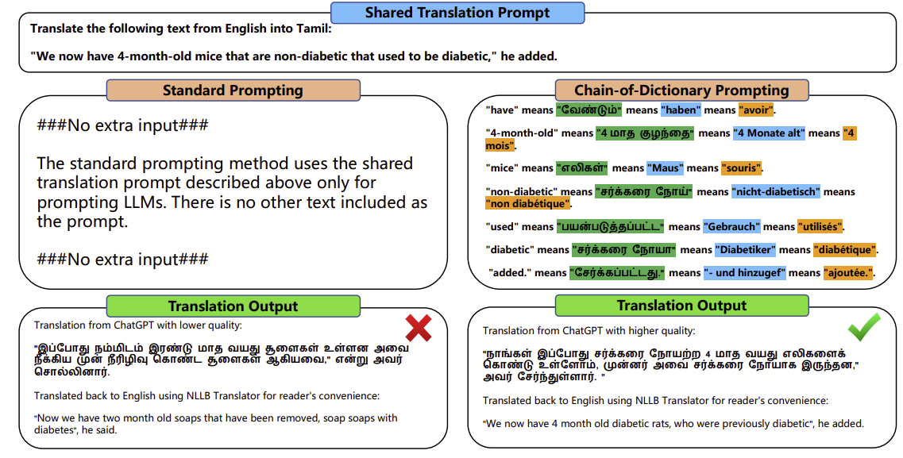
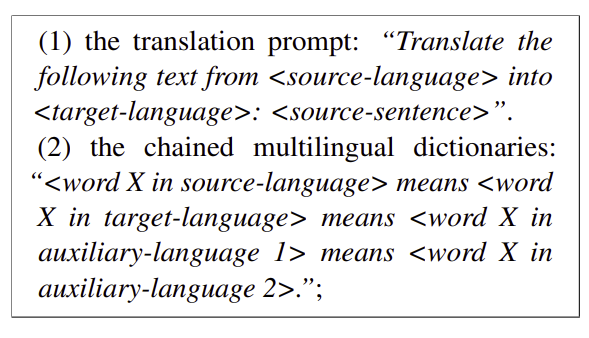
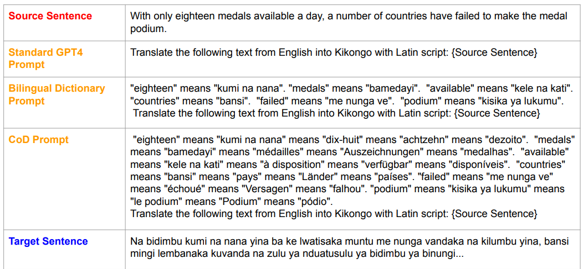
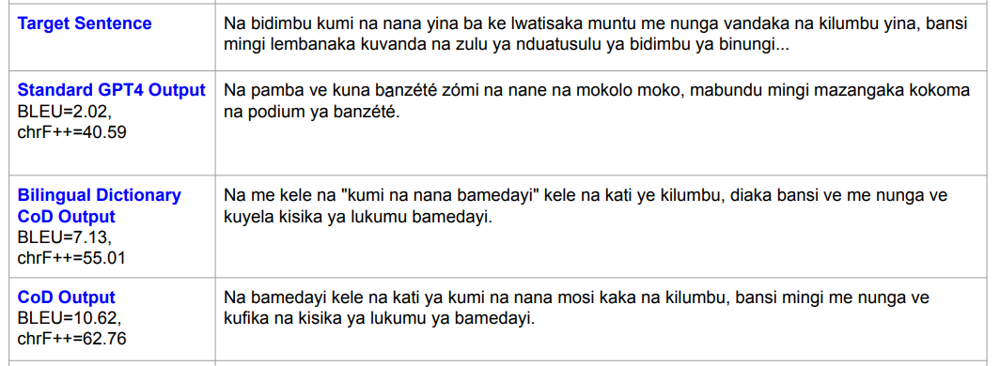
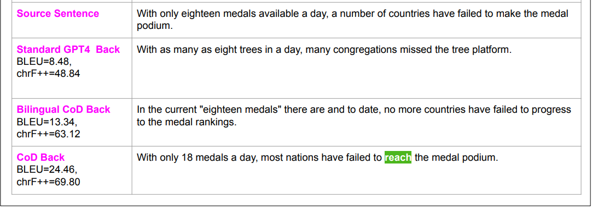

Large language models (LLMs) have shown impressive performance in multilingual machine translation (MNMT) without specific training for translation tasks. However, they still face challenges when translating low-resource languages. Our experiments show that using a bilingual dictionary between the source and target languages can help improve translations. Building on this idea, we propose a new framework called **Chain-of-Dictionary Prompting (COD)**. 

COD enhances LLM translation by linking multilingual dictionaries for some input words, providing more linguistic context and improving cross-lingual understanding. Our results demonstrate that COD significantly boosts translation accuracy, achieving up to 13x higher chrF++ scores for low-resource languages like English to Serbian (Cyrillic script) on the FLORES-200 dataset. 

We also highlight that chaining multilingual dictionaries is more effective than few-shot in-context learning for these languages. COD enables LLMs like ChatGPT to outperform state-of-the-art translators, such as NLLB 3.3B, for low-resource language pairs.

The **chrF++ score** is a metric used to evaluate the quality of machine translation. It measures the similarity between the translated text produced by a model and a reference translation, focusing on character-level precision and recall. Here's a breakdown:

### Key Features:
1. **Character-Level Focus**: Unlike metrics such as BLEU that operate on word-level n-grams, chrF++ works at the character level. This is particularly useful for languages with rich morphology or agglutinative structures, where small changes at the character level can significantly alter meaning.
   
2. **Precision and Recall**: The score considers both precision (how much of the translation matches the reference) and recall (how much of the reference is covered by the translation). This balance ensures the metric captures both completeness and accuracy.

3. **n-grams**: chrF++ uses character n-grams (sequences of characters of length n, where n can vary) to capture context and structure in the translation. 

4. **Weighted Averaging**: The "+" in chrF++ refers to the addition of word-level n-gram precision and recall to the calculation. This helps improve its effectiveness by combining character-level and word-level insights.

### Why It’s Useful:
- It works well for low-resource and morphologically rich languages where word boundaries are less defined or translations may involve significant rephrasing.
- It is more sensitive to small linguistic changes, making it better suited for nuanced evaluation.

Language models can translate by following a simple prompt, like:  
*"Translate the following sentence to English from French:"* followed by a French sentence.  

However, these models often struggle with rare words, especially in low-resource languages. To address this issue, we propose improving translation by using **multilingual dictionaries**.  

Our approach provides dictionary hints as part of the prompt, offering word meanings across multiple languages. For example, adding a string like:  
*"‘limit’ means ‘Grenze’ means ‘çäk’"*  
at the beginning of a translation prompt helps the model better understand specific terms.  

Inspired by **Chain-of-Thought (CoT)** reasoning, we introduce a **Chain-of-Dictionary (COD)** method. This approach uses linked translations from multiple dictionaries as prior knowledge, guiding the model step-by-step to enhance its multilingual translation capabilities.  

By combining multilingual dictionary hints with task-specific instructions, our method improves translation in a **zero-shot** setting, without imposing strict rules on how the model uses the provided knowledge.

---

We conducted extensive experiments using our proposed framework, **COD (Chain-of-Dictionary Prompting for Machine Translation)**, which significantly improves low-resource language translation on the FLORES-200 benchmark. COD works across many language pairs between English and other languages, using various language models.  

Our analysis shows that COD outperforms both bilingual dictionary prompts and approaches that separate word mappings, highlighting the effectiveness of chaining multilingual dictionaries. COD also performs better than standard few-shot demonstrations for low-resource languages, likely because few-shot examples retrieved are often irrelevant to the target translation.  

### Key Contributions:
1. We introduce **COD**, a novel framework that uses chained multilingual dictionaries in prompts to substantially improve translation by large language models (LLMs).  
2. Our experiments on FLORES-200 show that COD improves translation performance in most language pairs. It enables ChatGPT to translate better for many languages and even succeed in cases where ChatGPT struggles.  
3. COD outperforms few-shot learning and even surpasses the state-of-the-art translator **NLLB 3.3B** in some cases. Additionally, we show that truncating stopwords from dictionaries reduces computation without sacrificing performance.

---

The FLORES-200 dataset is a multilingual benchmark specifically designed for evaluating machine translation across 200 languages. It provides sentence-level parallel data in various languages, allowing for consistent evaluation across diverse language pairs. Here's a sample representation of the dataset:

---

### **English**:  
> The young boy quickly ran to the store to buy some candy.  

### **French**:  
> Le jeune garçon a couru rapidement au magasin pour acheter des bonbons.  

### **Spanish**:  
> El joven corrió rápidamente a la tienda para comprar dulces.  

### **Swahili**:  
> Kijana huyo alikimbia haraka kwenda dukani kununua pipi.  

### **Hindi**:  
> वह लड़का जल्दी से दुकान भागा कुछ मिठाई खरीदने के लिए।  

### **Bengali**:  
> ছেলেটি দ্রুত দোকানে ছুটে গেল কিছু মিষ্টি কিনতে।  

### **Serbian (Cyrillic)**:  
> Младић је брзо потрчао до продавнице да купи слаткише.  

### **Amharic**:  
> ወንዱ ብሩህ ልጅ እንደ እቅፍ ከሱቅ ወደ ሱቅ ተንከባለለ እና አንደበት ሽቦአል።  

---

### Structure:
Each sentence has translations across all 200 languages, covering low-resource, medium-resource, and high-resource languages. The dataset includes culturally neutral, everyday sentences to ensure wide applicability in machine translation tasks.

## The prompts for each sentence consist of two parts

---

The authors avoided using **few-shot in-context learning** (where you give examples to help the model learn) because it’s hard to find good, relevant examples for low-resource languages. This makes it less effective for improving translations in these cases.

Instead, they found that their **COD (Chain-of-Dictionary)** approach worked better. For example:

- If you break the dictionary into separate, non-chained pieces like this:  
  **"Word X in the source language means Word X in the target language."**  
  **"Word X in the source language means Word X in auxiliary language 1."**  
  **"Word X in the source language means Word X in auxiliary language 2."**  
  the results are worse.

Chaining dictionaries (connecting words across multiple languages) provides better context and improves translations significantly.

---

The authors suggest using the following method to improve translation with low-resource languages:

1. **Extract Keywords**: First, they use a prompt like **“Extract the words from the following texts: <input-sentence>”** to get important words from the source language. This is done using an LLM like ChatGPT.

2. **Translate with MT Models**: The extracted words are then translated into multiple languages (like French, German, and Portuguese) using existing machine translation models (e.g., NLLB). These translations create a **multilingual dictionary** for the COD approach.

3. **Translation with COD**: When translating, the model uses these dictionaries to get the translations of keywords from different languages and adds them to the translation prompt to help the model produce a better translation.

4. **Chained Languages**: The method uses a chain of **5 languages** in the prompt: the **source language**, the **target language**, and three **auxiliary languages** (French, German, and Portuguese) that the LLM handles well. 

This approach helps the LLM translate better by giving it extra context using multiple languages. The authors plan to explore using even more languages in the future.

---

1. **Extracting Keywords**:  
   Large Language Models (like ChatGPT) were given a prompt:  
   *“Extract the words from the following texts: <input-sentence>”*  
   This was used to pick out important words (keywords) from sentences in the source language.

2. **Translating Keywords**:  
   These extracted keywords were then translated into other languages using the **NLLB translator** (a translation tool). The translations were based on an English dataset called **FLORES-200**, which provides texts in multiple languages.

3. **Excluding Unsupported Languages**:  
   Three languages that the **NLLB translator** doesn't support were left out of the experiments.

4. **Removing Stopwords**:  
   To save time and computation, common words that don't add much meaning (like "and," "the," "is")—called **stopwords**—were removed. An existing list of stopwords was used for this step.

This process created dictionaries for the experiments, where each dictionary contained important translated words for a specific language.

---

1. **Translation into Rare Words**:  
   Using **NLLB 3.3B** (a powerful translation model), words were translated into rare words in the target language through multiple attempts.

2. **Translation Back into English**:  
   The translated rare words were then translated back into English.

3. **Checking Meaning with ChatGPT**:  
   ChatGPT was used to check if the translated-back English word had the **same meaning** as the original English word.  

4. **Repeat for Accuracy**:  
   If the meanings didn’t match, the process was repeated up to 3 times to improve accuracy.

5. **Success Rate**:  
   This approach worked for **71% of the words**, meaning their translations were accurate within 3 tries.

6. **Handling Failures**:  
   Words that couldn’t be successfully translated within 3 tries were **left out** of the dictionaries used in the experiments.

This ensured that the dictionaries only contained reliable translations.

---

Here’s a simplified explanation of the prompt design process:

1. **Choosing a Translation Prompt**:  
   Previous studies compared different prompts for machine translation and found that a simple prompt like:  
   *“Translate the following text into <target-language>: <source-sentence>”*  
   worked well across a few languages.  

2. **Our Modified Prompt**:  
   In our experiments, we found that **removing the source language name** (e.g., "from English") reduced the accuracy. So, we used this more specific prompt:  
   *“Translate the following text from <source-language> into <target-language>: <source-sentence>.”*

3. **Handling Script Variations**:  
   Let me break it down more clearly:

    Some languages can be written in different **writing systems or scripts**. For example:  
    - **Chinese** can be written in **Simplified Script** (used in Mainland China) or **Traditional Script** (used in Taiwan and Hong Kong).  
    - Other languages, like **Achinese**, can also be written in multiple scripts, such as **Arabic script** or others.

    ### The Problem:  
    When you ask a language model to translate text without specifying the **script** (e.g., Simplified or Traditional for Chinese), the model might **guess** or default to the wrong one.  
    For instance:  
    - If you just say "Translate to Chinese," the model might generate **Simplified Chinese**, even if you need **Traditional Chinese**.

    ### The Solution:  
    To fix this, the prompt explicitly mentions the desired script. For example:  
    - Instead of saying “Translate to Chinese,” you say:  
    **"Translate to Chinese in Traditional Script."**  
    - Similarly, for Achinese, you specify:  
    **"Translate to Achinese with Arabic script."**

This careful design ensured the translations were accurate and used the correct language scripts.

---

---

Here’s an instruction template for students to write their code for data preprocessing, cleaning, and splitting:

---
